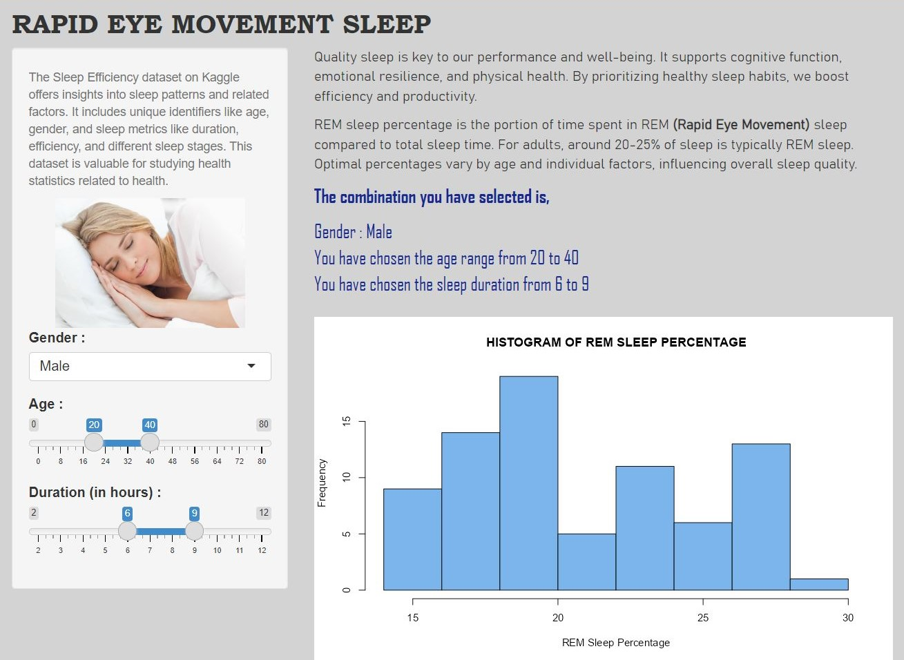

# Rapid Eye Movement Sleep Efficiency

##### Welcome to the Rapid Eye Movement Sleep Shiny App repository! 
##### This app allows users to explore Rapid Eye Movement (REM) sleep percentage based on different parameters such as gender, age range, and sleep duration range.

### Data
##### The app uses the Sleep Efficiency dataset from Kaggle, providing insights into sleep patterns and health metrics.
##### Link to data set : https://www.kaggle.com/datasets/equilibriumm/sleep-efficiency

 

    
  

